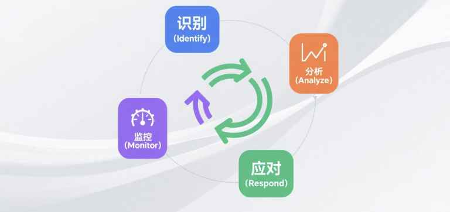

# 风险管理：从“救火队员”到“天气预报员”

## 风险管理的境界

初级项目经理是“救火队员”，哪里着火了就去哪里救。
高级项目经理是“天气预报员”，他会提前告诉你：“三天后有暴雨，请大家提前收好衣服，加固门窗。”

**风险 (Risk)**，就是一个**不确定**的事件或条件，一旦发生，就会对项目目标（如范围、进度、成本、质量）产生积极或消极的影响。

> 一个成熟的项目总监，其价值不在于解决了多少问题，而在于**让多少问题“本可以发生，但最终没有发生”**。风险管理，就是将这种不确定性，纳入可控范围的系统性过程。

## 我的风险管理流程：一个闭环体系

我的风险管理遵循一个动态的、持续循环的闭环流程，确保我们能系统性地应对各种不确定性。

**识别 (Identify) -> 分析 (Analyze) -> 应对 (Respond) -> 监控 (Monitor)**

## 实战演练：拆解“AI心理治疗师”项目的风险

我们以“AI心理治疗师”这个高风险、高不确定性的探索性项目为例，来演示这套流程。

### 第一步：风险识别 (Identify) - 我们可能会遇到什么麻烦？

在项目启动阶段，我会组织核心团队进行头脑风暴，并结合过往经验，识别出潜在的风险，并将其分类记录在**“风险登记册 (Risk Register)”**中。

* **技术风险**:
    * AI模型训练效果不达预期。
    * 选定的开源大模型存在安全漏洞或不持续维护。
    * 数据隐私与安全防护能力不足。
* **外部风险**:
    * **核心合作医院的数据质量不达标、配合度降低。**
    * 医疗器械认证的法规发生变化，审批失败。
* **资源风险**:
    * **核心算力服务器延迟到位。**
    * 关键的AI算法人才招聘困难。

### 第二步：风险分析 (Analyze) - 这个麻烦有多大？

识别出风险后，我们需要对其进行“评级”，以便把精力花在最重要的事情上。我会使用**风险矩阵（Probability x Impact）**进行量化分析。

| 风险点 | 可能性 (1-5) | 影响程度 (1-5) | 风险值 | 风险等级 |
| :--- | :---: | :---: | :---: | :---: |
| 核心算力服务器延迟到位 | 4 (高) | 5 (致命) | **20** | **高** |
| 核心医院数据质量不达标 | 3 (中) | 5 (致命) | **15** | **高** |
| AI模型效果不达预期 | 3 (中) | 4 (严重) | **12** | **中** |

通过分析，我们清晰地看到，“算力服务器”是当时项目中**最致命的单一风险点**。

### 第三步：风险应对 (Respond) - 我们该怎么办？

针对不同等级的风险，我们会制定不同的应对策略。主要有四种：规避、转移、减轻、接受。

* **针对“AI模型效果不达预期”（中风险）**
    * **策略：减轻 (Mitigate)**
    * **具体措施**：在项目初期就并行评测多种基座大模型（GLM, DeepSeek等），不把鸡蛋放在一个篮子里，并准备备选技术方案。

* **针对“核心医院数据质量不达标”（高风险）**
    * **策略：减轻 (Mitigate)**
    * **具体措施**：不被动接受数据。在项目流程中，设计并实施“数据接入前置校验”环节，建立清晰的《数据标准规范》，主动把控数据质量。

* **针对“核心算力服务器延迟到位”（高风险）**
    * **策略：减轻 (Mitigate) + 向上升级 (Escalate)**
    * **具体措施**：
        1.  **量化影响**：将此风险在周报中持续标记为**最高级别**，并**量化其对项目上线日期的影响**（“每延迟一个月，最终交付日期顺延一个月”）。
        2.  **主动管理**：持续向上管理，向发起人（我的领导）提供**明确的决策选项**（如“增加预算租用云算力”、“调整项目目标”或“正式接受延期”），以此推动问题解决。

### 第四步：风险监控 (Monitor) - 随时关注天气变化

风险不是一次性工作。我会将“风险审查”作为我们**项目周例会的固定议程**。
* **回顾**：当前最高级别的风险状态如何？我们的应对措施是否有效？
* **展望**：有没有新的风险出现？
* **更新**：动态更新我们的“风险登记册”，确保它始终是项目最新的“天气图”。

## 应对“未知-未知”风险：管理储备与组织韧性

对于那些完全无法预见的“黑天鹅”事件，我的策略是：
1.  **申请管理储备 (Management Reserve)**：在项目总预算之外，我会根据项目的不确定性，向管理层申请**15%-20%的应急储备金和时间缓冲**，专门用于应对这种计划外的意外。
2.  **拥抱敏捷 (Agility)**：通过短周期的迭代开发，我们可以快速响应变化。即使“黑天鹅”出现，我们的损失也被控制在一个冲刺周期内，能够迅速调整航向，避免积重难返。